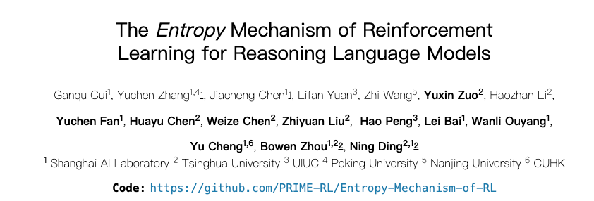
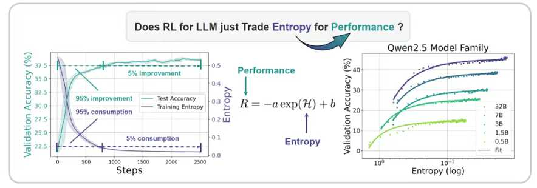
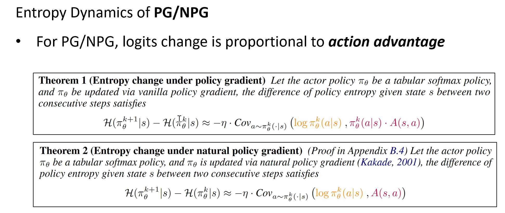
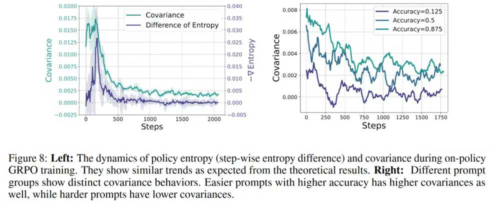
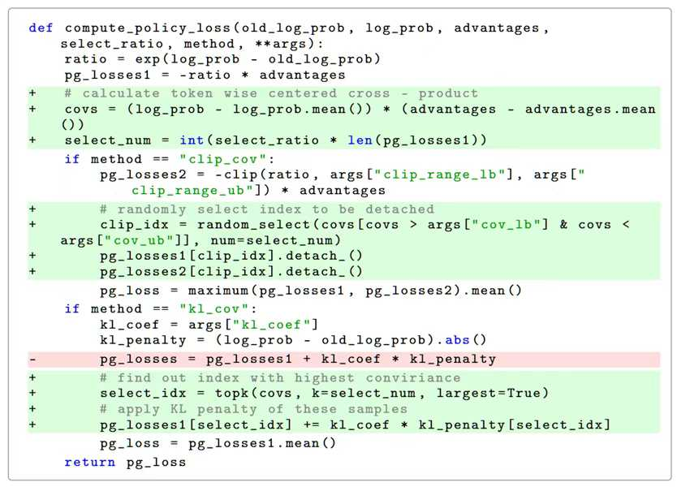
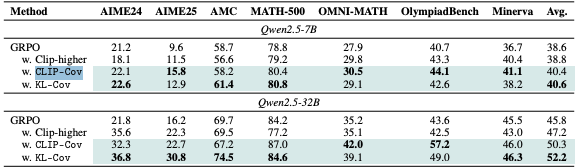
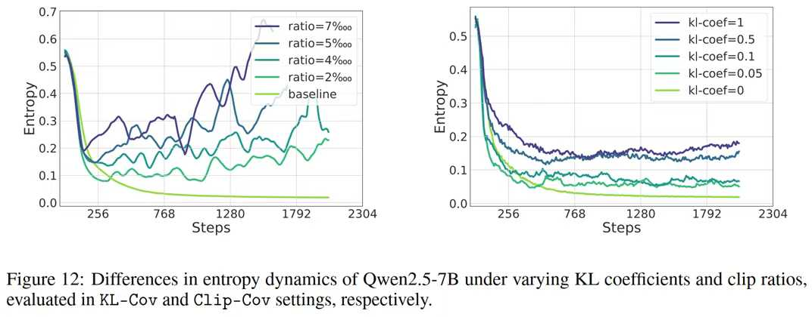
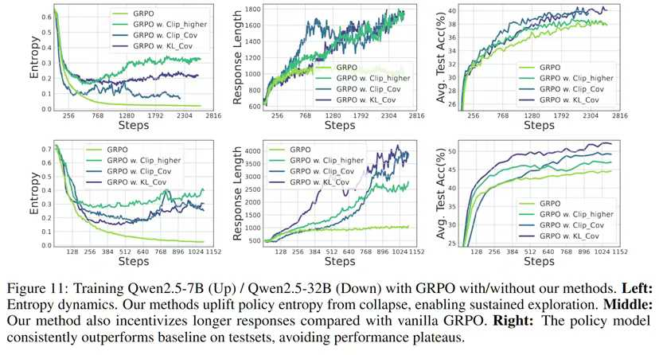

这是一篇来自上海人工智能实验室青年科学家崔淦渠发在朋友圈的文案。

 

  在经过作者本人同意的情况下，将内容整理后，发布在青稞社区的渠道上，帮助宣传！以下为编辑后的内容：



在RL训练LLM的过程中，普遍存在模型entropy迅速下降/性能迅速饱和的现象。这导致模型过度自信，进而削弱其探索能力，最终限制了性能的进一步提升。



我们通过广泛的实验，在不加熵干预的前提下建立了一个描述模型性能（R）与策略熵（H）关系的经验公式：

$$
R = -a * exp(H) + b
$$
揭示了两者间的“权衡”关系，即**性能的提升往往伴随着策略熵的消耗**。更重要的是，这一关系预示了性能的理论上限（当 $H=0$ 时，$R = -a+b$ ）。因此，**若不有效进行熵管理，单纯增加RL训练的计算资源，其效益可能受限**。



针对熵单调下降的现象，我们从理论与实验两方面深入分析了其动态机制。研究的核心结论是：**熵的动态变化主要由所选动作的概率与对应logits变化量（在策略梯度类算法中，该变化量与优势advantage成正比）之间的协方差所驱动**。



具体而言，**高概率且具备高优势的动作倾向于降低熵，反之，低概率但具备高优势的动作则有助于提升熵**。实验发现，在训练过程中，此协方差多数情况下为正值，从而导致熵持续下降。



基于对熵动态机制的理解，我们提出了两种针对性的熵控制方法：**Clip-Cov 与 KL-Cov**。这两种方法通过**对高协方差的token更新进行约束来控制熵**，防止其过早崩溃。实验结果表明我们提出的熵控制方法效果显著，能够促使模型进行更持续的探索，从而摆脱“低熵陷阱”，并取得更优性能。

以Qwen2.5-32B模型为例，与基线GRPO相比，我们的方法实现了平均6.4%的性能提升；在AIME24等高难度基准测试中，提升高达15.0%。







大模型在为强化学习提供强大先验的同时，其更为狭窄的输出分布是一把双刃剑。最近许多工作表明简单地使模型的输出分布更加狭窄就可以提升模型表现，但这同时也榨干了模型继续探索和提升的空间。我们希望为scale大模型的强化学习提供一个以熵为核心的全新视角。

相关论文与代码均已公开发布，欢迎大家阅读、指正与交流！

```
论文：The Entropy Mechanism of Reinforcement Learning for Reasoning Language Models
链接：https://arxiv.org/abs/2505.22617
代码：https://github.com/PRIME-RL/Entropy-Mechanism-of-RL
```

 
