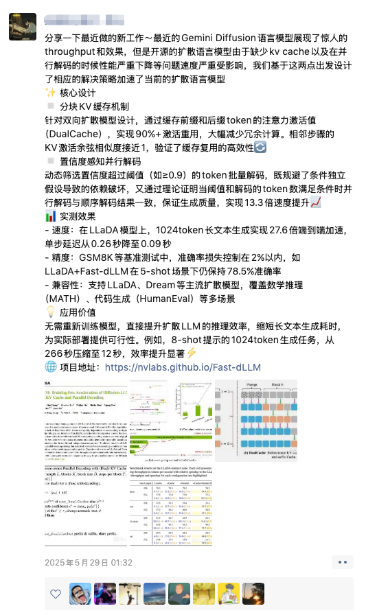

## 前言
> 这是一篇来自香港大学博士生吴成岳发在朋友圈的文案。
>
> 首发：[https://mp.weixin.qq.com/s/o0a-swHZOplknnNxpqlsaA](https://mp.weixin.qq.com/s/o0a-swHZOplknnNxpqlsaA)


<!--more-->



## 正文

最近的Gemini Diffusion语言模型展现了惊人的throughput和效果，但是开源的扩散语言模型由于缺少kv cache以及在并行解码的时候性能严重下降等问题速度严重受影响。


我们基于这两点出发，提出了Fast-dLLM，并设计相应的解决策略加速当前的扩散语言模型。


## 核心设计
### 分块KV缓存机制
针对双向扩散模型设计，通过缓存前缀和后缀token的注意力激活值（DualCache），实现90%+激活重用，大幅减少冗余计算。相邻步骤的KV激活余弦相似度接近1，验证了缓存复用的高效性


### 置信度感知并行解码

动态筛选置信度超过阈值（如≥0.9）的token批量解码，既规避了条件独立假设导致的依赖破坏，又通过理论证明当阈值和解码的token数满足条件时并行解码与顺序解码结果一致，保证生成质量，实现13.3倍速度提升


## 实测效果


- **速度**：在LLaDA模型上，1024token长文本生成实现27.6倍端到端加速，单步延迟从0.26秒降至0.09秒
- **精度**：GSM8K等基准测试中，准确率损失控制在2%以内，如LLaDA+Fast-dLLM在5-shot场景下仍保持78.5%准确率
- **兼容性**：支持LLaDA、Dream等主流扩散模型，覆盖数学推理（MATH）、代码生成（HumanEval）等多场景

## 应用价值
无需重新训练模型，直接提升扩散LLM的推理效率，缩短长文本生成耗时，为实际部署提供可行性。例如，8-shot提示的1024token生成任务，从266秒压缩至12秒，效率提升显著。

```
论文：Fast-dLLM: Training-free Acceleration of Diffusion LLM by Enabling KV Cache and Parallel Decoding
链接：https://nvlabs.github.io/Fast-dLLM/paper/fast_dllm.pdf
代码：https://github.com/NVlabs/Fast-dLLM
项目主页：https://nvlabs.github.io/Fast-dLLM
```