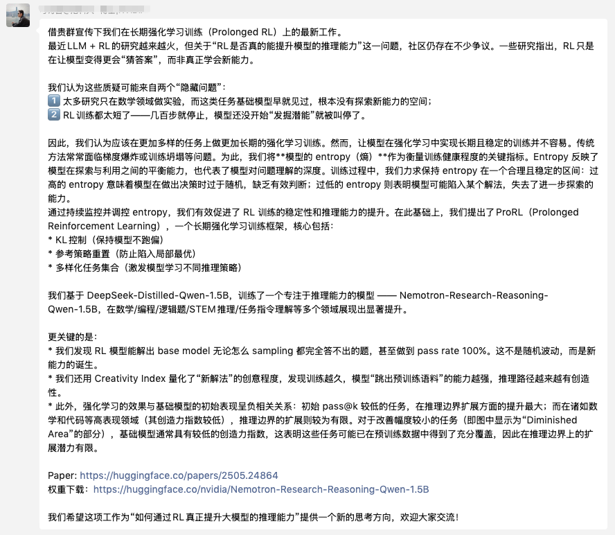
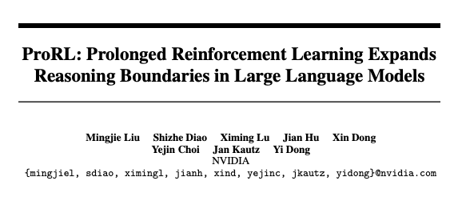
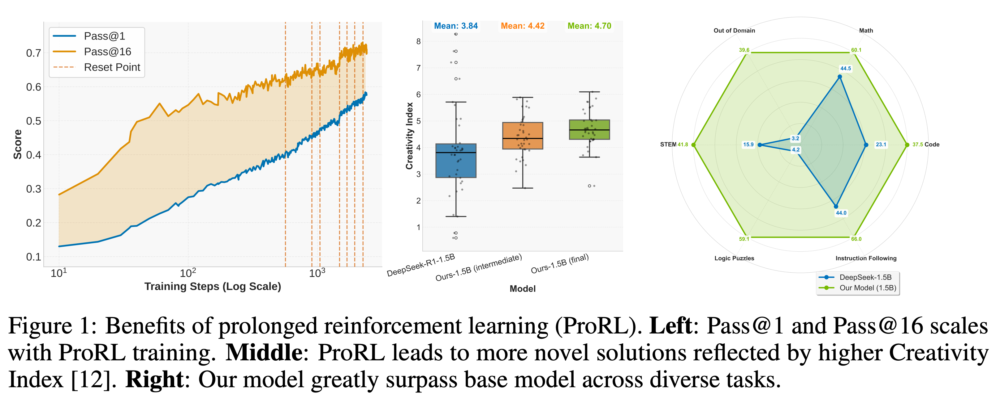
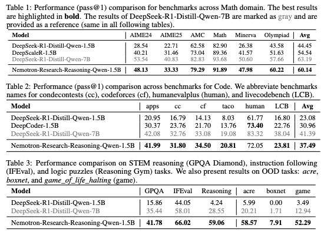
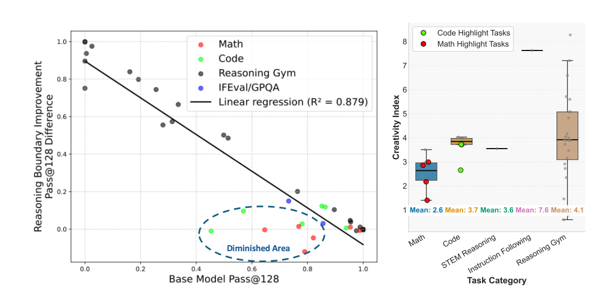
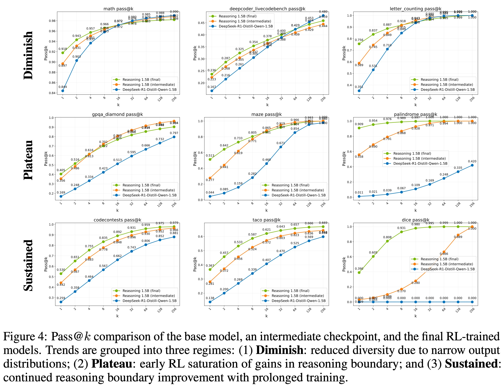

## 前言
> 这是一篇来自刁诗哲(research scientist @ NVIDIA Research)的文案。
> 首发：[https://mp.weixin.qq.com/s/o0a-swHZOplknnNxpqlsaA](https://mp.weixin.qq.com/s/o0a-swHZOplknnNxpqlsaA)



## 正文



```
论文：ProRL: Prolonged Reinforcement Learning Expands Reasoning Boundaries in Large Language Models
Abs：https://arxiv.org/abs/2505.24864
权重下载：https://huggingface.co/nvidia/Nemotron-Research-Reasoning-Qwen-1.5B
```

最近LLM + RL的研究越来越火，但关于“**RL是否真的能提升模型的推理能力**”这一问题，社区仍存在不少争议。一些研究指出，RL只是在让模型变得更会“猜答案”，而非真正学会新能力。

我们认为这些质疑可能来自两个“隐藏问题”：
- 太多研究只在数学领域做实验，而这类任务基础模型早就见过，根本没有探索新能力的空间；
- RL训练都太短了——几百步就停止，模型还没开始“发掘潜能”就被叫停了。



因此，我们认为应该在更加多样的任务上做更加长期的强化学习训练。然而，让模型在强化学习中实现长期且稳定的训练并不容易。传统方法常常面临梯度爆炸或训练坍塌等问题。为此，我们将 **模型的 entropy（熵）** 作为衡量训练健康程度的关键指标。**Entropy 反映了模型在探索与利用之间的平衡能力，也代表了模型对问题理解的深度**。

训练过程中，我们力求保持 entropy 在一个合理且稳定的区间：**过高的 entropy 意味着模型在做出决策时过于随机，缺乏有效判断；过低的 entropy 则表明模型可能陷入某个解法，失去了进一步探索的能力**。

通过持续监控并调控 entropy，我们有效促进了 RL 训练的稳定性和推理能力的提升。在此基础上，我们提出了**ProRL（Prolonged Reinforcement Learning），一个长期强化学习训练框架**，核心包括：
- KL控制（保持模型不跑偏）
- 参考策略重置（防止陷入局部最优）
- 多样化任务集合（激发模型学习不同推理策略）

我们基于 DeepSeek-Distilled-Qwen-1.5B，训练了一个专注于推理能力的模型 —— Nemotron-Research-Reasoning-Qwen-1.5B，在数学/编程/逻辑题/STEM推理/任务指令理解等多个领域展现出显著提升。



更关键的是：

我们发现 RL 模型能解出 base model 无论怎么 sampling 都完全答不出的题，甚至做到 pass rate 100%。**这不是随机波动，而是新能力的诞生**。

我们还用 Creativity Index 量化了“新解法”的创意程度，发现训练越久，**模型“跳出预训练语料”的能力越强，推理路径越来越有创造性**。



此外，强化学习的效果与基础模型的初始表现呈负相关关系：初始 pass@k 较低的任务，在推理边界扩展方面的提升最大；而在诸如数学和代码等高表现领域（其创造力指数较低），推理边界的扩展则较为有限。对于改善幅度较小的任务（即图中显示为“Diminished Area”的部分），基础模型通常具有较低的创造力指数，这表明这些任务可能已在预训练数据中得到了充分覆盖，因此在推理边界上的扩展潜力有限。



我们希望这项工作为“**如何通过RL真正提升大模型的推理能力**”提供一个新的思考方向，欢迎大家交流！