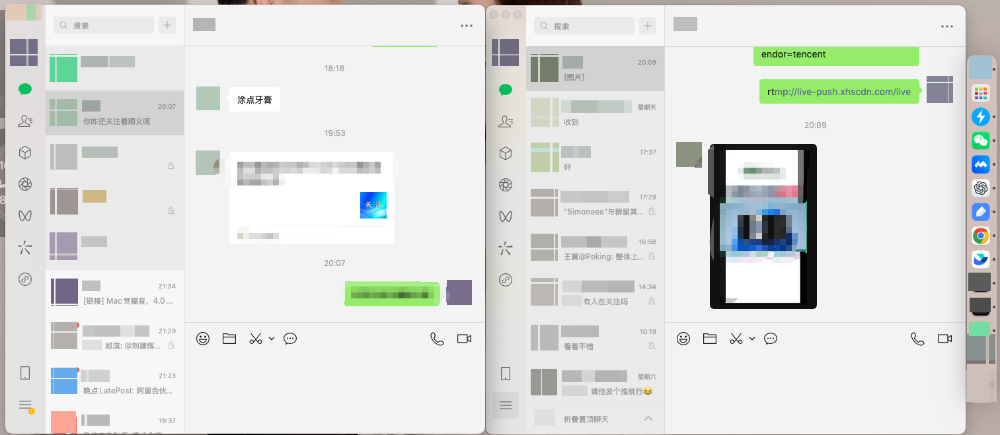

```
sudo cp -R /Applications/WeChat.app /Applications/WeChat2.app

sudo /usr/libexec/PlistBuddy -c "Set :CFBundleIdentifier com.tencent.xinWeChat2" /Applications/WeChat2.app/Contents/Info.plist

sudo codesign --force --deep --sign - /Applications/WeChat2.app

nohup /Applications/WeChat2.app/Contents/MacOS/WeChat >/dev/null 2>&1 &
```



每次开启需要命令太麻烦，直接可以用mac的自动化操作解决，参考：[https://wangguo.site/Blog/2023/Q3/macwei-xin-shuang-kai/](https://wangguo.site/Blog/2023/Q3/macwei-xin-shuang-kai/)

### 微信每次更新后，需要先执行

```
sudo rm -rf /Applications/WeChat2.app
```

然后重新执行上面的四行代码～～