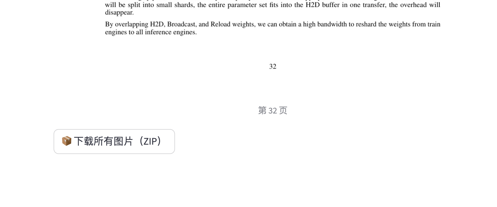

### 安装streamlit、PyMuPDF

```
pip install streamlit
pip install PyMuPDF
```

### 代码

```
import streamlit as st
import fitz  # PyMuPDF
import os
import tempfile
import zipfile
from io import BytesIO

def pdf_to_images(pdf_file, zoom_x=2.0, zoom_y=2.0, rotation_angle=0):
    """将 PDF 文件的每一页转为图像并返回图像路径列表和所在目录"""
    images = []
    tmpdirname = tempfile.mkdtemp()
    pdf = fitz.open(stream=pdf_file.read(), filetype="pdf")
    for page_index in range(len(pdf)):
        page = pdf[page_index]
        matrix = fitz.Matrix(zoom_x, zoom_y).prerotate(rotation_angle)  # 修复方法名
        pix = page.get_pixmap(matrix=matrix, alpha=False)  # 也注意新版用 get_pixmap()
        img_path = os.path.join(tmpdirname, f"page_{page_index + 1}.png")
        pix.save(img_path)
        images.append(img_path)
    pdf.close()
    return images, tmpdirname

def zip_images(image_paths):
    """将图片打包为 zip 并返回 BytesIO 对象"""
    zip_buffer = BytesIO()
    with zipfile.ZipFile(zip_buffer, "w", zipfile.ZIP_DEFLATED) as zip_file:
        for path in image_paths:
            zip_file.write(path, arcname=os.path.basename(path))
    zip_buffer.seek(0)
    return zip_buffer

# 页面设置
st.set_page_config(page_title="PDF 转 PNG 图片", layout="centered")
st.title("📄 PDF 转 PNG 图片")

# 上传 PDF 文件
uploaded_file = st.file_uploader("上传 PDF 文件", type=["pdf"])

if uploaded_file:
    st.success("文件上传成功，开始转换...")

    # 可选参数调整
    zoom = st.slider("缩放比例（越大越清晰，体积越大）", 1.0, 5.0, 2.0, step=0.5)
    rotation = st.selectbox("旋转角度", [0, 90, 180, 270], index=0)

    # 转换 PDF 为图片
    with st.spinner("正在转换为图片..."):
        image_paths, folder = pdf_to_images(uploaded_file, zoom_x=zoom, zoom_y=zoom, rotation_angle=rotation)

    st.success(f"转换完成，共 {len(image_paths)} 页。")

    # 显示图片
    for i, img_path in enumerate(image_paths):
        st.image(img_path, caption=f"第 {i+1} 页", use_container_width=True)

    # 打包为 zip 文件
    zip_file = zip_images(image_paths)

    # 下载按钮
    st.download_button(
        label="📦 下载所有图片（ZIP）",
        data=zip_file,
        file_name="converted_images.zip",
        mime="application/zip"
    )
```

### 效果


还可以一键下载图片.zip

