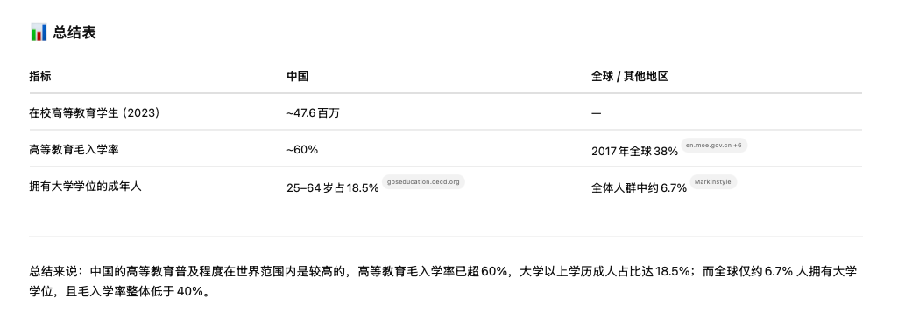

今天和老高聊到了关于Dinq的问题，让我突然有了一点感触，期间也想起了和另一位做算法朋友的交流，以及和智谱一位做投资朋友的聊天，不禁在想：

### **AI/AGI时代真的来了吗？**

现在的我们，天天都泡在了AI的信息茧房里，关注的全是AI的人和事，周边的人也都在AI这个圈子里。但是我们回过头来想想，AI这个圈子到底有多大？

从目前的理解来看，想要了解AI，乃至接触、从事AI这个行业，基本都是需要上过大学的人，但是这个数据能有多大，在中国，乃至全球又能占到多大的比例

这是来自ChatGPT的一个数据，也就说中国有大学教育经历的有20%（比预想的要高），全球不到（7%）。

我们假设这些人都在AI圈子里，或者说都有机会、都有能力认知去了解AI，那剩下的人呢？他们很大程度上是无法理解AI，以及使用AI，AI似乎还是“少数人”的游戏。

现在的AI研究的是怎么刷分、怎么去解决高认知人群所能解决、所需要结局的问题，比如设计、广告、程序.......用最牛逼的人去解决最牛逼的人的问题，这个逻辑很难说“AI时代的来临“吧！！！

什么时候，AI能让三四线城市的普通人用到，对他们产生价值的时候，或许才是AI时代真正的来临。

这里就不得不提到之前的算法朋友，他的一个愿景就是**将AI应用于中国制造业**（很宏伟的想法，震撼）。

### 在这个时代，我又想做什么

我不是AI研究人员，甚至连技术人员也算不上，更没有研究生甚至博士的学历，不懂AI又为什么还要处在AI这个行业呢？

很现实的想法当然是赚钱，但宏伟的想法自然是“**以青稞之火，起燎原之势**”

当时在和智谱的朋友聊的时候（其实是面试，但是最后没有面上），就有聊到相关的事情。

我为什么一定要加入到AI这个领域呢？或者应该说怎们理解是否在AI这个领域？难道只有做AI技术研究的才算？在AI这股浪潮中，我用自己的力量去让更多的人了解、学习AI，难道不算价值体现吗？我构建青稞社区这个平台，让更多人看到AI前沿成果，难道这不算价值吗？

参与不代表一定要做技术～～～每个人都有分工，每个人都可以按照自己的能力、兴趣，去选择这个链条上的某一环完成。我不会做超出自己能力之外的事情，前提是有足够的试错成本。认清自己的能力，定位自己想做的事情，然后朝着这个目标努力就好～～

选择不一样，但是都有价值～

